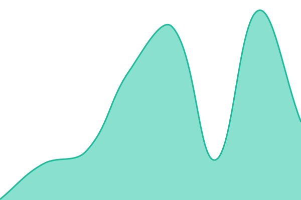

# [📈 Live Status](https://status.cronotracker.com): <!--live status--> **🟥 Complete outage**

This repository contains the open-source uptime monitor and status page for [CronoTech Consulting](https://cronotech.org), powered by [Upptime](https://github.com/upptime/upptime).

With [Upptime](https://upptime.js.org), you can get your own unlimited and free uptime monitor and status page, powered entirely by a GitHub repository. We use [Issues](https://github.com/cronotech/uptime/issues) as incident reports, [Actions](https://github.com/cronotech/uptime/actions) as uptime monitors, and [Pages](https://status.cronotracker.com) for the status page.

<!--start: status pages-->
<!-- This summary is generated by Upptime (https://github.com/upptime/upptime) -->
<!-- Do not edit this manually, your changes will be overwritten -->
<!-- prettier-ignore -->
| URL | Status | History | Response Time | Uptime |
| --- | ------ | ------- | ------------- | ------ |
|  [CronoTracker App](https://app.cronotracker.com) | 🟥 Down | [crono-tracker-app.yml](https://github.com/CronoTech/uptime/commits/HEAD/history/crono-tracker-app.yml) | 

 7524ms
     
 | 

<a href="https://status.cronotracker.com/history/crono-tracker-app">82.86%</a>
    

|  [CronoTracker API](https://app.cronotracker.com/api/version) | 🟥 Down | [crono-tracker-api.yml](https://github.com/CronoTech/uptime/commits/HEAD/history/crono-tracker-api.yml) | 

 7383ms
     
 | 

<a href="https://status.cronotracker.com/history/crono-tracker-api">82.87%</a>
    

|  [CronoTech Consulting Home Landing](https://cronotech.org) | 🟥 Down | [crono-tech-consulting-home-landing.yml](https://github.com/CronoTech/uptime/commits/HEAD/history/crono-tech-consulting-home-landing.yml) | 

 392ms
     
 | 

<a href="https://status.cronotracker.com/history/crono-tech-consulting-home-landing">82.89%</a>
    

<!--end: status pages-->

[**Visit our status website →**](https://status.cronotracker.com)

## 📄 License

- Powered by: [Upptime](https://github.com/upptime/upptime)
- Code: [MIT](./LICENSE) © [Anand Chowdhary](https://anandchowdhary.com), supported by [Pabio](https://pabio.com)
- Data in the `./history` directory: [Open Database License](https://opendatacommons.org/licenses/odbl/1-0/)
